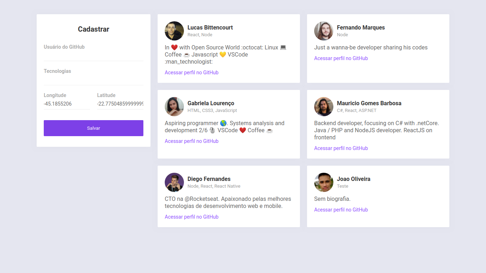

# Dev Radar

## Descrição

Uma maneira de encontrar devs de mesma stack próximos a você.

## Como usar

- clone este repositório
- entre na pasta do projeto
- digite `yarn` para instalar as dependências
- digite `yarn start` para iniciar o projeto web 

## Imagens

